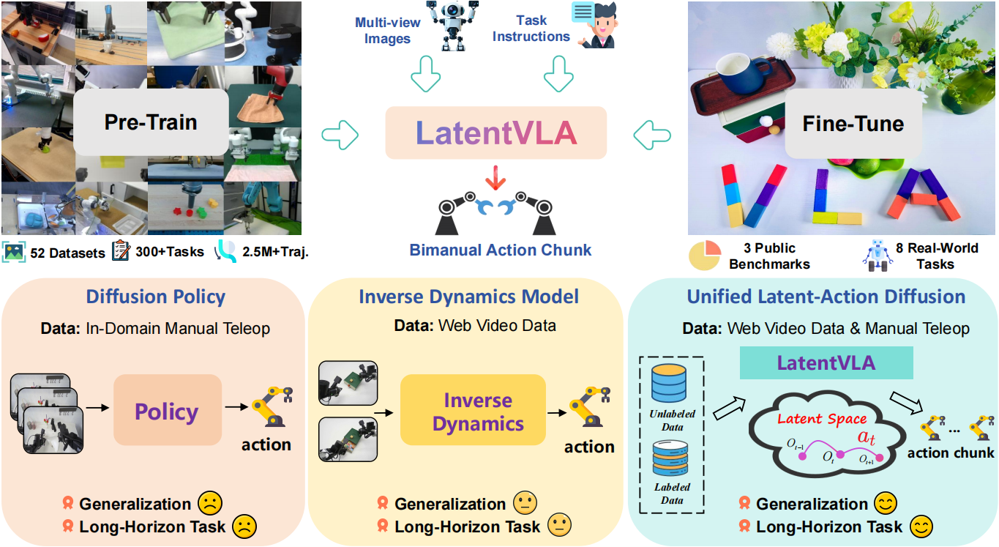

# LatentVLA: Taming Latent Space for Generalizable and Long-Horizon Dual-Arm Manipulation




## 🏗️ Project Structure

```
latentvla/
├── latentvla/                 # Main code package
│   ├── models/               # Model implementations
│   │   ├── base.py          # Base model classes
│   │   ├── ta_lam.py        # TA-LAM implementation (Stage 1)
│   │   └── utils/           # Model utilities
│   │       ├── transformer_utils.py
│   │       ├── siglip_utils.py
│   │       └── attention_utils.py
│   ├── data/                # Data processing
│   ├── trainers/            # Training modules
│   └── utils/               # Common utilities
│       ├── config_utils.py
│       └── data_utils.py
├── configs/                 # Configuration files
│   └── ta_lam_config.yaml
├── scripts/                 # Training scripts
│   └── train_ta_lam.py
└── README.md
```

## 🎯 Core Features

### Stage 1: Temporal-Attentive Latent Action Model (TA-LAM)

Implementation of the first stage of the three-stage framework described in the paper:

#### 1. **Attention-Driven Inverse Dynamics Model (IDM)**
- **Language-Guided Spatial Attention**: Uses SigLIP for vision-language alignment
- **Temporal Disentanglement**: Combines absolute temporal encoding and relative positional encoding
- **Multi-view Support**: Handles multi-camera inputs

#### 2. **Latent Forward Dynamics Model (FDM)**
- Predicts future observations from latent actions
- Supports training on unlabeled videos
- Enforces latent actions to contain sufficient information

#### 3. **Action Decoder**
- Maps abstract latent space to concrete robot commands
- Lightweight MLP architecture
- Supervised training only on labeled robot data

## 🚀 Quick Start

### 1. Install Dependencies

```bash
cd latentvla
pip install -r requirements.txt
```

### 2. Configure Data

Edit `configs/ta_lam_config.yaml`:

```yaml
data:
  pretrain_datasets:
    - name: "unlabeled_videos"
      path: "/path/to/your/unlabeled/videos"
      use_reconstruction_loss: true
      use_action_loss: false
    - name: "robot_trajectories" 
      path: "/path/to/your/robot/data"
      use_reconstruction_loss: true
      use_action_loss: true
```

### 3. Start Training

```bash
python scripts/train_ta_lam.py --config configs/ta_lam_config.yaml
```

### 4. Run Demo

```bash
python scripts/demo.py
```


### 2. Data Processing Pipeline

- **Multi-modal Input**: Image sequences + Proprioception + Language instructions
- **Temporal Window**: History length h=4
- **Attention Masking**: Language-guided spatial attention
- **Temporal Encoding**: Absolute + Relative positional encoding

### 3. Training Strategy

- **Unlabeled Data**: Reconstruction loss only
- **Labeled Data**: Reconstruction loss + Action loss
- **Mixed Precision**: Supports AMP for training acceleration
- **Model Compilation**: PyTorch 2.0 optimization

## 📈 Paper Correspondence

| Paper Component | Code Implementation | File Location |
|----------------|---------------------|---------------|
| Language-Guided Spatial Attention | `LanguageGuidedAttention` | `models/utils/attention_utils.py` |
| Temporal Disentanglement | `TemporalAttentiveIDM` | `models/ta_lam.py` |
| SigLIP Integration | `SigLIPWrapper` | `models/utils/siglip_utils.py` |
| Joint Optimization | `TA_LAM.forward()` | `models/ta_lam.py` |


## 📋 TODO

- [x] Implement Stage 1: TA-LAM (Temporal-Attentive Latent Action Model)
- [ ] Implement Stage 2: LADT (Latent Action Diffusion Transformer)
- [ ] Implement Stage 3: Real-world Fine-tuning Framework
- [ ] Add complete data loaders
- [ ] Create evaluation scripts
- [ ] Add visualization tools


